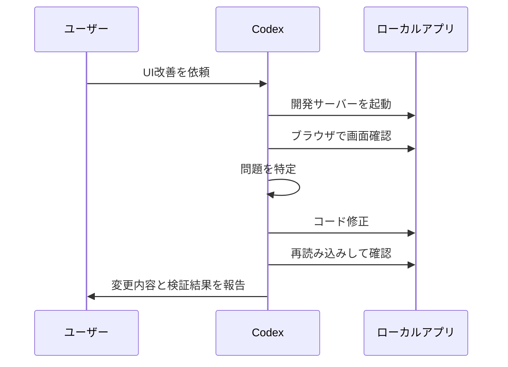
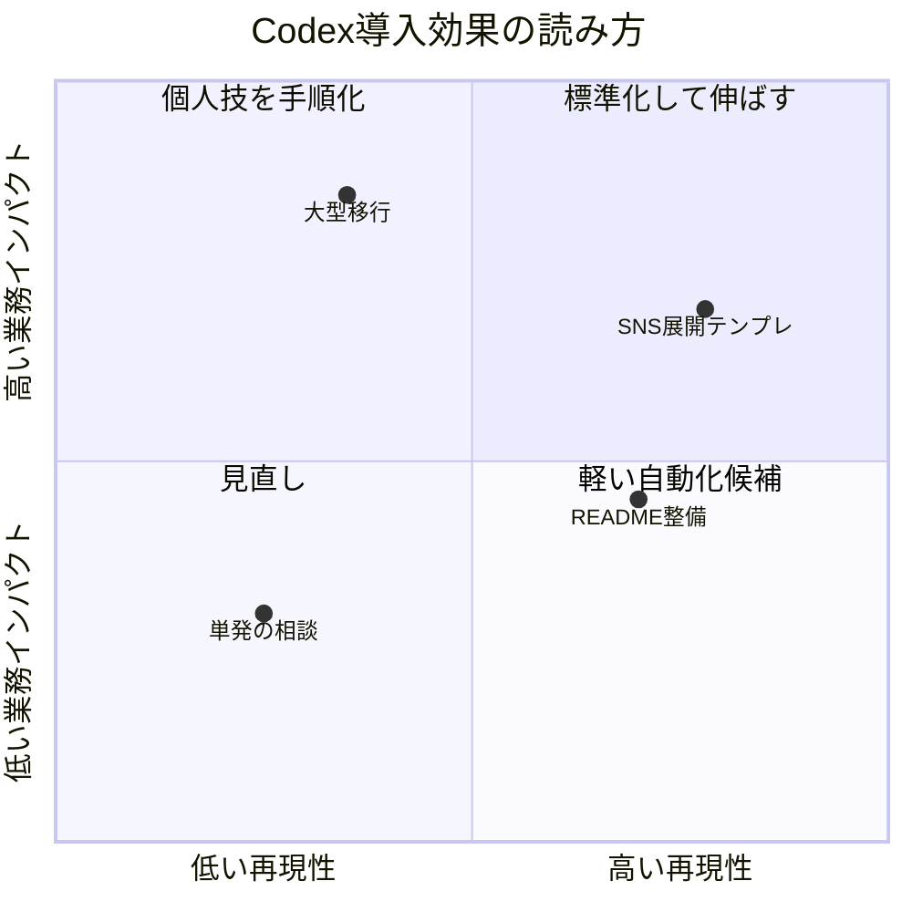
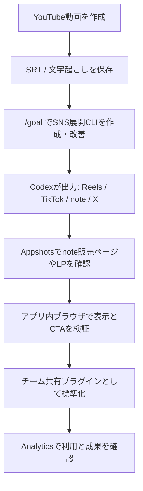

# 2026年5月22日版 OpenAI Codex 最新情報まとめ

最終確認日: 2026年5月22日  
対象: OpenAI Codex / ChatGPT Codex / Codex CLI / Codex Desktop / Codex Cloud  
主な出典: OpenAI Developers、OpenAI Help Center、指定X投稿

この記事は、2026年5月22日時点でOpenAIから出ているCodex関連の最新情報を、実務で使える形に整理した資料です。単なるニュース要約ではなく、「それを使うと具体的に何ができるのか」「どう導入するのか」「どんなプロンプトで頼めばいいのか」まで含めます。

今回の中心は、次の6テーマです。

| テーマ | ひとことで言うと | 実務インパクト |
|---|---|---|
| Appshots | アプリ画面の状態をCodexに渡して、視覚的に修正できる | UI修正、LP改善、管理画面改善が速くなる |
| `/goal` の正式化 | 長時間・複数ステップの開発目標をCodexに任せやすくなった | 大きめの実装、調査、移行、検証を一つの流れにできる |
| アプリ内ブラウザでの反復作業 | Codexがブラウザを見ながら修正、検証、再修正できる | フロントエンドの「見た目確認ループ」を自動化しやすい |
| チーム間プラグイン共有 | 組織内でCodex用のプラグインや作業能力を共有しやすくなった | 社内標準ワークフローをAIエージェントに配れる |
| Analytics改善 | Business / Enterprise向けに利用状況を把握しやすくなった | 導入効果、利用率、管理ルールを確認しやすい |
| どこでもCodex | Web、CLI、IDE、デスクトップ、モバイル、ブラウザ操作まで接点が拡大 | 思いついた場所から開発タスクを動かせる |

## まず全体像: Codexは「会話するエディタ」から「作業を進めるチームメイト」へ

Codexは、以前の「コードを書いてくれるAI」から、かなり役割が広がっています。いまのCodexは、コードベースを読み、ファイルを編集し、テストを実行し、ブラウザで画面を確認し、必要なら長時間のタスクを継続し、結果をレビュー可能な形で返します。

今回の発表群を見ると、OpenAIがCodexをどこに向けているかがかなり明確です。方向性は「開発の各工程を分断しないこと」です。

従来のAI開発支援は、次のように分かれていました。

| 工程 | これまで起きがちだった分断 |
|---|---|
| 要件整理 | チャットで相談するが、コードには反映されない |
| 実装 | エディタ内で補完されるが、全体設計は弱い |
| UI確認 | ブラウザを人間が見て、手で指示し直す |
| テスト | AIが書いたコードを人間が別途検証する |
| チーム展開 | 各メンバーが別々の使い方をして再現性がない |
| 管理 | 導入効果や利用状況が見えにくい |

新しいCodexは、この分断を少しずつつなげています。Appshotsは画面状態をCodexに渡します。アプリ内ブラウザは、Codex自身が見た目や挙動を確認する入り口になります。`/goal` は長めの仕事を一つの目標として管理します。プラグイン共有は、チーム固有の作業手順を配布する仕組みになります。Analyticsは、組織導入時の運用判断に使えます。

つまり、Codexの価値は「AIにコードを書かせる」だけではありません。価値の中心は、「人間が毎回やっていた確認、往復、手順、レビュー準備を、同じ作業環境の中でCodexに進めさせること」です。


## 今回の更新を読む前に知っておきたい前提

今回の情報は、OpenAI DevelopersのCodexドキュメント、OpenAI Help Centerのリリースノート、指定されたOpenAI DevelopersのX投稿をもとに整理しています。機能説明の断定は、OpenAI公式ドキュメント側で確認できる内容に限定しています。

重要なのは、Codexには複数の入口があることです。

| 入口 | 向いている作業 |
|---|---|
| ChatGPT内のCodex | 相談から実装依頼へつなぐ、非エンジニアも使いやすい |
| Codex CLI | ローカルリポジトリでの実装、検証、修正 |
| Codex Desktop | ファイル編集、ブラウザ検証、画像や画面を使った作業 |
| IDE拡張 | エディタ内での実装支援、差分確認 |
| Codex Cloud | リモートで長めの作業、PR作成、並列タスク |
| モバイル / Web | 思いついたタスク投入、進捗確認、軽いレビュー |

今回の発表は、この複数入口を「ばらばらの機能」ではなく「どこからでも同じCodexに仕事を渡せる体験」に近づけるものです。

### 用語ミニ辞典

この記事では、OpenAI公式の機能名はそのまま使います。ただし、意味が取りづらい用語はここで先にかみ砕いておきます。

| 用語 | かんたんな意味 |
|---|---|
| Codex | コードを書くだけでなく、調査、修正、テスト、画面確認まで進める開発用AI |
| Codex app | MacやWindowsで使うCodex専用アプリ |
| CLI | ターミナルで使うコマンド版Codex。黒い画面で操作する開発者向け入口 |
| IDE拡張 | VS Codeなどのコード編集ソフト内でCodexを使うための追加機能 |
| Codex Cloud | 自分のPCではなく、クラウド側でCodexに作業させる実行場所 |
| リポジトリ | コードや資料をまとめて管理しているフォルダ。GitHubで公開する単位 |
| 差分 | 修正前と修正後の違い |
| PR | Pull Requestの略。GitHubで「この変更を取り込んでよいか」確認する依頼 |
| CTA | Call To Actionの略。登録、購入、問い合わせなど、読者に押してほしいボタンや導線 |
| レスポンシブ | スマホ、タブレット、PCなど画面幅に合わせて表示を変えること |
| プラグイン | Codexに新しい作業能力や外部サービス連携を追加する部品 |
| スキル | Codexに覚えさせる作業手順。定型作業のマニュアルに近い |
| Analytics | 利用状況を数字で見る画面。誰がどれくらい使っているかを確認する |
| ホスト | Codexが実際に動いている元のPC。モバイルから操作する場合の接続先 |

## 1. Appshots: 画面を見せて、UI修正を一気に進める

関連X投稿: [OpenAI Developers / Appshots](https://x.com/OpenAIDevs/status/2057530207976989179?s=20)


### 何が新しいのか

Appshotsは、アプリの画面状態をCodexに渡し、視覚的な情報をもとに修正や改善を進めるための機能です。OpenAI Help Centerのリリースノートでは、Codexがアプリのスクリーンショットや視覚的状態を扱い、UI改善やデバッグに活用できる流れが説明されています。

従来、UI修正では人間がこういう往復をしていました。

1. ブラウザで画面を見る
2. スクリーンショットを撮る
3. 「このボタンがズレている」「この文字が読みにくい」と説明する
4. AIが修正する
5. またブラウザで確認する
6. まだ違うので指示し直す

Appshotsの重要性は、この「目で見た違和感」をCodexが扱いやすくなることです。コードだけ見ても、画面上の窮屈さ、余白の崩れ、ボタンの視認性、スマホ幅での折り返し、入力フォームの使いにくさは判断しづらい。Appshotsはそこを埋めます。

### 具体的に何ができるのか

Appshotsが実務で効くのは、主にフロントエンドとコンテンツ制作です。

| 用途 | できること |
|---|---|
| LP改善 | 最初に見える部分、押してほしいボタン、見出し、余白、視線の流れを修正する |
| 管理画面改善 | テーブル、フィルタ、検索、サイドバー、詳細画面を見やすくする |
| スマホ最適化 | 横スクロール、文字の折り返し、ボタンサイズ、タップ領域を直す |
| バグ再現 | 画面上の崩れやエラー表示を見せて原因候補を調べる |
| デザイン実装 | Figmaや既存画面との差分を見ながら近づける |
| SNS / note導線 | 記事ページや登録フォームの見え方を改善する |

たとえば、YouTube台本をnoteに展開する発信者なら、Appshotsを使って「note販売ページのCTAが弱い」「スマホで価格表示が埋もれる」「無料部分と有料部分の境目が伝わりにくい」といった改善をCodexに依頼できます。

### 実際の使い方

Appshotsは、macOS版のCodex appで使えます。いちばん重要な操作は、見せたいアプリのウィンドウを前面に出して、左右のCommandキーを同時に押すことです。カスタムホットキーを設定している場合は、そのホットキーでも使えます。

| 操作 | やること | 補足 |
|---|---|---|
| 1 | Codex appをMacで開く | CLI単体では新しいAppshotは作れない |
| 2 | 見せたいアプリやブラウザ画面を前面に出す | 前面ウィンドウだけが対象 |
| 3 | 左右のCommandキーを同時に押す | 設定済みならカスタムAppshotsホットキーでも可 |
| 4 | macOSの権限確認が出たら許可する | 画面収録、Accessibilityが必要になる場合がある |
| 5 | AppshotがCodexスレッドに添付される | 直近60秒以内に触ったスレッドがあれば、そこに追加されやすい |
| 6 | 「この画面を見て直して」と依頼する | スクショだけでなく、取得可能な画面内テキストも文脈になる |

Appshotsが取り込むのは、前面ウィンドウの画像と、アプリ側から取得可能なテキストです。Google Docs、Gmail、Google Sheets、Google Slidesなどでは、画面に見えているスクリーンショットは渡せても、画面外の全文までは取れない場合があります。その場合は、Google DriveやGmailなどの対応プラグインも併用します。

### 導入方法

基本の流れは、Codexが使える環境で対象アプリを起動し、画面状態をCodexに渡せる状態にすることです。ローカルアプリなら、開発サーバーを起動してCodexにURLを開かせます。既存のWebアプリなら、Codexのアプリ内ブラウザやスクリーンショット機能で対象画面を確認させます。

実務での導入手順は次の通りです。

| 手順 | 内容 | 注意点 |
|---|---|---|
| 1 | 対象画面を決める | いきなり全ページではなく、1画面から始める |
| 2 | 現状の目的を説明する | 「登録率を上げたい」「入力ミスを減らしたい」など |
| 3 | 画面状態をCodexに渡す | スクショ、Appshot、ブラウザ表示など |
| 4 | 改善基準を指定する | スマホ優先、業務効率優先、ブランド重視など |
| 5 | Codexに修正させる | CSS、コンポーネント、文言、状態表示を更新 |
| 6 | 再確認する | DesktopとMobileの両方で見る |
| 7 | 変更点と理由をまとめさせる | GitHubでの確認依頼やチーム共有に使う |

### 具体プロンプト

```text
この画面のAppshotを見て、初回訪問者が迷わず次の行動を取れるように改善してください。

目的:
- 30秒以内にサービス内容が伝わること
- 登録・購入などのボタンがスマホでも見つけやすいこと
- 既存のブランドトーンは崩さないこと

やってほしいこと:
1. 視覚的に弱い箇所を3つ特定
2. 影響が大きい順に修正
3. DesktopとMobileで表示確認
4. 変更理由をGitHubの確認依頼文としてまとめる
```

```text
管理画面の一覧ページをAppshotベースで改善してください。

観点:
- 毎日使う業務画面なので、装飾よりも一覧性を優先
- フィルタ、検索、ステータス確認が迷わないこと
- テーブルの列幅と折り返しを調整し、横スクロールを減らすこと

完了条件:
- 375px幅でも主要操作が隠れない
- 行の高さが不必要に増えない
- 空状態、読み込み中、エラー状態も自然に見える
```

### 使うときのコツ

Appshotsを使うときは、「見た目を良くして」だけでは弱いです。何のために良くするのかを明示します。登録率なのか、業務効率なのか、読みやすさなのか、ブランド感なのかで、正解が変わるからです。

特に効果が高い指示は、「対象ユーザー」と「成功条件」を入れることです。

```text
対象ユーザーは、スマホで初めてこのページを見る副業初心者です。
成功条件は、ページを開いて10秒以内に「何を学べるか」と「どこを押せばよいか」が分かることです。
```

このように言うと、Codexは単にCSSを整えるのではなく、画面の役割に合わせて改善できます。

## 2. `/goal` は実験段階を卒業: 長めの開発タスクを任せやすくなった

関連X投稿: [OpenAI Developers / `/goal`](https://x.com/OpenAIDevs/status/2057530209470210453?s=20)


### 何が新しいのか

`/goal` は、Codexに「単発の修正」ではなく「達成したい目標」を渡すための入口です。Help Centerのリリースノートでは、実験段階を終え、長時間のタスクや複数ステップの作業をCodexに任せる体験として位置づけられています。

これはかなり大きな変化です。AIにコードを頼むとき、多くの人はこう言います。

```text
このバグを直して
```

しかし実際の開発は、バグ修正だけでは終わりません。原因調査、再現、影響範囲確認、テスト追加、修正、レビュー用説明、必要ならドキュメント更新まであります。`/goal` は、この一連の作業を「目標」として扱うための考え方です。

### 具体的に何ができるのか

`/goal` が向いている作業は、短い命令では足りないものです。

| 作業 | `/goal` に向いている理由 |
|---|---|
| バグ修正 | 再現、原因特定、修正、テストまで含められる |
| 機能追加 | 要件整理、既存設計調査、実装、検証をまとめられる |
| リファクタリング | 影響範囲を見ながら段階的に進められる |
| UI改善 | Appshotsやブラウザ確認と組み合わせられる |
| ライブラリ移行 | 破壊的変更、型エラー、テスト修正をまとめられる |
| ドキュメント整備 | 実装との差分を見ながら更新できる |
| 自動化構築 | コマンド、スクリプト、README、検証まで任せられる |

たとえば、「YouTube動画の文字起こしからSNS投稿を自動生成するツールを作る」という作業は、単発プロンプトだと曖昧です。しかし `/goal` なら、入力形式、出力形式、保存先、テスト、READMEまで含めた目標にできます。

### 実際の使い方

`/goal` はCodex app、IDE extension、CLIで一般利用できるようになった目標管理モードです。Codex appでは、画面下の入力欄に `/goal` と入力して開始します。最初に目標を詰めたい場合は、先に `/plan` で方針を作り、固まった内容を `/goal` にします。

| 入口 | 使い方 | 補足 |
|---|---|---|
| Codex app | 画面下の入力欄に `/goal` と入力 | 進行中は入力欄の上に進捗行が出る |
| Codex app | `/plan` で計画してから `/goal` | 大きい仕事ではこの順番が安定 |
| CLI | `/goal` を使う、または必要に応じて `codex features enable goals` | 表示されない場合は `features.goals` を有効化 |
| 設定ファイル | `config.toml` に `[features] goals = true` | 環境によって必要な場合がある |
| 実行中 | 進捗行のボタンで一時停止、再開、編集、クリア | 追加メッセージで方向修正もできる |

`/goal` は「命令」ではなく「完了条件を持つ目的」です。途中でCodexが迷ったときに復帰できるよう、最初の入力に「目的」「対象範囲」「成功条件」「検証方法」を入れます。

### 導入方法

`/goal` を使うときは、目標を「完了条件つき」で書きます。曖昧な要望ではなく、Codexが自分で進捗判断できる形にするのがコツです。

| 書くべき項目 | 例 |
|---|---|
| 背景 | なぜ必要なのか |
| 対象範囲 | どのディレクトリ、どの画面、どの機能か |
| 完了条件 | 何ができたら終わりか |
| 制約 | 触ってはいけない箇所、使うべき技術 |
| 検証方法 | 実行するテスト、確認する画面 |
| 成果物 | GitHubの確認依頼文、README、スクショ、手順書など |

### 具体プロンプト

```text
/goal
YouTube動画の文字起こしを入力すると、Instagram Reels、TikTok、note、X向けの再利用素材を生成するCLIを追加してください。

背景:
- 1本のYouTube動画から複数SNSに展開する作業を短縮したい
- 既存の運用では、文字起こしから手作業で各媒体向けに書き換えている

対象:
- scripts/ または tools/ 配下にCLIを追加
- 既存のREADMEに使い方を追記

完了条件:
- 入力: .txt または .srt
- 出力: reels.md, tiktok.md, note.md, x-thread.md
- 各媒体で文字数、構成、トーンが違う
- サンプル入力で動作確認できる
- 実行コマンドと出力例をREADMEに記載

制約:
- 既存ファイルの unrelated な変更はしない
- 外部APIキーが必要な場合は.env.exampleだけ追加し、実キーは扱わない
```

```text
/goal
管理画面のユーザー一覧で、検索・絞り込み・ページネーションを実装してください。

完了条件:
- 名前、メール、ステータスで検索できる
- URLクエリに検索条件が残る
- ローディング、空状態、エラー状態がある
- 既存のデザインシステムに合わせる
- テストを追加し、既存テストも通す
- 変更内容をレビューしやすい単位でまとめる
```

### `/goal` の失敗を減らす書き方

`/goal` は便利ですが、目標が大きすぎると迷子になります。失敗を減らすには、次のように「成果物」と「検証」を明確にします。

| 悪い書き方 | 良い書き方 |
|---|---|
| いい感じに改善して | 初回訪問者がCTAを見つけやすいように、Heroと料金導線を改善して |
| バグを全部直して | `npm test` で落ちている3件を原因別に直し、追加テストを入れて |
| 自動化して | `input/` のSRTから4媒体向けMarkdownを生成するCLIを作って |
| リファクタして | `src/api/*` の重複したfetch処理を共通化し、外部挙動は変えないで |

## 3. Codexのアプリ内ブラウザ: 見て、直して、また見る反復作業

関連X投稿: [OpenAI Developers / アプリ内ブラウザでの反復作業](https://x.com/OpenAIDevs/status/2057530210967523399?s=20)


### 何が新しいのか

Codexのアプリ内ブラウザは、ローカルまたはリモートのWeb画面をCodexが開き、実際の見た目や動作を確認しながら作業するための機能です。OpenAI DevelopersのComputer Useページでは、Codexがブラウザ操作を扱う際の考え方や、Locked useと呼ばれる安全な制御の説明がされています。

この更新の本質は、Codexが「コードを書いたあとに、自分で画面確認する」方向に近づいたことです。Web画面を作る仕事では、コード上は正しくても画面上では崩れることがよくあります。余白、文字の折り返し、重なり順、マウスを乗せた時の表示、入力中の枠、ポップアップ、フォームのエラー表示、スマホ表示などは、実際に見ないと分かりません。

### 具体的に何ができるのか

アプリ内ブラウザを使うと、次のような反復ができます。



向いている作業は次の通りです。

| 作業 | ブラウザ確認で見えること |
|---|---|
| スマホ表示の確認 | モバイル幅で文字やボタンが崩れないか |
| フォーム改善 | 入力、バリデーション、エラー表示が自然か |
| 導線確認 | 押してほしいボタン、メニュー、戻る動きが分かりやすいか |
| モーダル確認 | 開閉、フォーカス、背景スクロールが正しいか |
| 読み込み状態 | Spinner、Skeleton、空状態が破綻しないか |
| クリック操作 | 実際に押せるか、意図通り遷移するか |

### 実際の使い方

アプリ内ブラウザは、Codex appのツールバー、URLクリック、手動入力、またはショートカットで開けます。Macでは `Cmd+Shift+B`、Windowsでは `Ctrl+Shift+B` です。ブラウザ画面にコメントを残し、そのコメントをCodexに修正対象として渡せるのが強いところです。

| 操作 | やること | 補足 |
|---|---|---|
| 開く | ツールバー、URLクリック、手動入力、`Cmd+Shift+B` | Windowsは `Ctrl+Shift+B` |
| 対象 | 自分のPCで動かしている開発用ページ、ファイルのプレビュー、ログイン不要の公開ページ | ログイン、Cookie、拡張機能、既存Chromeタブは対象外 |
| コメント | 注釈モードをオンにして要素や範囲を選択 | `Shift` + クリックで範囲選択 |
| 即送信 | `Cmd` を押しながらクリック | コメントをすぐ送る操作に使える |
| スタイル指定 | 注釈入力欄横の設定アイコンから細かい見た目を指定 | フォント、文字、余白、色などの目標を渡せる |
| Codex操作 | Browser pluginを有効化し、`@Browser` または「ブラウザを使って」と頼む | クリック、入力、スクショ、ページ内部の確認、修正後の再確認に使える |

注意点として、アプリ内ブラウザはログインが必要な画面、普段のChromeプロファイル、Cookie、拡張機能、既存タブを使う前提の作業には向きません。ログイン済みサイトを扱う場合は、Codex Chrome extensionや通常ブラウザを使う方が自然です。

### 導入方法

ローカルアプリで使う場合は、基本的に次の流れです。

1. Codexに対象リポジトリを開かせる
2. 依存関係を確認する
3. 開発サーバーを起動する
4. Codexに対象URLを開かせる
5. 画面状態を確認させる
6. 修正させる
7. 再度ブラウザで検証させる

よくあるコマンド例は次の通りです。

```bash
npm install
npm run dev
```

```bash
pnpm install
pnpm dev
```

```bash
uv sync
uv run app.py
```

ただし、実際のコマンドはプロジェクトごとに異なります。Codexには、まずREADMEやpackage.jsonを読ませて、既存の起動方法に合わせるよう指示します。

### 具体プロンプト

```text
このリポジトリの起動方法を確認し、ローカル開発サーバーを立ち上げてください。
その後、アプリ内ブラウザでトップページ、料金ページ、問い合わせページを確認し、スマホ幅とデスクトップ幅で崩れている箇所を修正してください。

完了条件:
- 主要CTAが全幅で見切れない
- ヘッダーがモバイルで重ならない
- フォーム送信前後の状態が分かる
- 最後に確認したURLと画面幅を報告する
```

```text
アプリ内ブラウザで http://localhost:3000/dashboard を開き、実際にフィルタ、検索、詳細画面遷移を操作してください。
操作中に見つかったUIの詰まり、読み込み状態の不足、エラー表示の弱さを修正してください。

修正後:
- もう一度同じ操作を実行
- 残った課題があれば箇条書き
- 変更したファイルと理由をまとめる
```

### Locked useをどう考えるか

OpenAI DevelopersのComputer Useドキュメントでは、Codexがブラウザやコンピュータ操作を行う際の安全性に関する説明があります。実務では、次の区別が重要です。

| 操作 | Codexに任せやすい | 注意が必要 |
|---|---|---|
| ローカル画面確認 | はい | 機密データが表示される場合は注意 |
| ボタンのクリック検証 | はい | 外部送信や課金につながる操作は避ける |
| フォーム入力テスト | はい | 本番環境ではダミーデータを使う |
| 投稿・公開 | 原則、人間確認 | SNS投稿、公開、送信は慎重に |
| 決済・課金 | 人間確認必須 | 自動操作しない |

Codexにブラウザ操作を任せるときは、「本番で送信しない」「削除しない」「課金しない」「公開しない」といった境界を明示すると安全です。

## 4. チーム間でプラグインを共有: Codexを社内標準ワークフローに近づける

関連X投稿: [OpenAI Developers / チーム間プラグイン共有](https://x.com/OpenAIDevs/status/2057530212339097994?s=20)


### 何が新しいのか

Codexのプラグイン共有は、チームや組織で共通の能力、手順、接続先、スキルを配布しやすくする流れです。Help Centerのリリースノートでは、Codexのプラグインやコネクタの共有に関する改善が案内されています。

個人利用のAIでは、「自分がうまくプロンプトを書けるか」が成果を左右します。しかしチーム利用では、それだけでは足りません。チーム全体で同じ品質を出すには、よく使う手順をプラグインやスキルとしてまとめる必要があります。

たとえば、AI収益化ラボのような運用では、次のような作業が繰り返されます。

| 繰り返し作業 | プラグイン化・スキル化すると何が良いか |
|---|---|
| YouTube台本からReels台本を作る | 媒体別の長さ、導入、CTAを統一できる |
| Premiere書き出し後のSRT整形 | ファイル名、保存先、確認項目を固定できる |
| note記事化 | 見出し構成、販売導線、注意書きを統一できる |
| X投稿ツリー作成 | フック、分割、出典表記の型を共有できる |
| GitHub PRレビュー | レビュー観点、テスト基準、禁止操作を統一できる |

### 具体的に何ができるのか

プラグイン共有でできることは、単に便利ツールを配ることではありません。チームの作業標準をCodexに読み込ませることです。

| 用途 | 具体例 |
|---|---|
| 社内ルール共有 | 「公開前に必ず確認」「機密情報を出さない」など |
| ドメイン知識共有 | 商品名、顧客層、禁止表現、ブランドトーン |
| ワークフロー共有 | 調査、記事化、SNS展開、GitHub更新の手順 |
| ツール接続共有 | Google Drive、GitHub、Slack、Notionなど |
| 確認基準共有 | 安全性、品質、テスト、誰でも使いやすい画面かどうか |

これにより、メンバーごとのAI活用のばらつきが減ります。新人でも、プラグイン化された手順を使えば、ベテランの作業型に近い出力が得られます。

### 実際の使い方

Codexのチーム利用では、プラグイン、スキル、アプリ連携を「個人の便利機能」ではなく「チームで共有する作業能力」として扱います。Codex appでは、サイドバーのSkillsから作業手順を確認でき、チームが作成したスキルもプロジェクトをまたいで探せます。Business / Enterpriseでは、チーム用の設定画面で、利用できるプラグインや実行できる操作を管理します。

| 操作 | やること | 補足 |
|---|---|---|
| 探す | Codex appのサイドバーでSkillsを開く | チームが作成したスキルを確認する |
| 使う | タスク内でスキル名やプラグイン名を指定する | 例: `@Browser`、Google Drive、Gmailなど |
| 作る | 繰り返し作業をスキル化、必要ならプラグイン化 | 手順、入力、出力、禁止事項を入れる |
| 管理する | チーム設定のAppsで有効・無効や許可する操作を調整 | Business / Enterprise向け |
| 共有する | チームのプロジェクトや設定で同じ手順を使う | 特定の人しかできない状態を減らす |
| 改善する | 失敗パターンをメモリやAGENTS.mdに反映 | 使うほど精度を上げる |

最初から複雑なプラグインを作る必要はありません。まずは「成功したプロンプト」「チェックリスト」「禁止事項」をスキルとしてまとめ、それを繰り返し使ってからプラグイン化を検討します。

### 導入方法

チーム導入では、いきなり大量のプラグインを作るより、頻度が高く、失敗時の損失が小さい作業から始めます。

おすすめの導入ステップは次の通りです。

| フェーズ | やること | 成果物 |
|---|---|---|
| 1 | 繰り返し作業を棚卸し | 作業一覧 |
| 2 | 1つだけ手順化 | チェックリスト |
| 3 | Codex用プロンプトにする | 定型プロンプト |
| 4 | スキル / プラグイン化 | チーム共有可能な単位 |
| 5 | 使った結果を記録 | 改善メモ |
| 6 | Analyticsで利用を見る | 継続判断 |

最初に作るなら、たとえば「YouTube動画からSNS展開素材を作るプラグイン」が向いています。理由は、成果物が明確で、繰り返し頻度が高く、チームメンバーにとって価値が分かりやすいからです。

### 具体プロンプト

```text
このチームで共有するCodexプラグイン案を設計してください。

目的:
- YouTube動画1本から、Instagram Reels、TikTok、note、X投稿に展開する作業を標準化したい

含めたい能力:
- SRTまたは文字起こしを読む
- 媒体別に構成を変える
- noteは見出しと導入を厚めにする
- Reels/TikTokは冒頭3秒のフックを重視する
- Xはツリー投稿形式にする
- 出典や注意点を最後にまとめる

出力:
- プラグイン名
- 使う場面
- 入力ファイル
- 出力ファイル
- 禁止事項
- 初期プロンプト
- レビュー観点
```

```text
このリポジトリのAGENTS.mdと既存ワークフローを読み、チームで共有すべきCodexスキルを3つ提案してください。

条件:
- 1つ目は動画制作
- 2つ目はSNS展開
- 3つ目はGitHub公開資料作成

各スキルについて:
- トリガー条件
- 実行手順
- 必須確認
- 失敗時のメモリ追記先
- サンプルプロンプト
をまとめてください。
```

### チーム導入時の注意点

プラグイン共有で一番大事なのは、便利さよりも境界線です。チームで使うAIは、個人利用より事故の影響が大きくなります。

最低限、次のルールは明文化します。

| ルール | 理由 |
|---|---|
| 公開、投稿、送信、削除、課金は人間確認 | 取り消しづらい操作だから |
| APIキーやパスワードを扱わない | 漏洩リスクが高いから |
| 出典が必要な資料は一次情報を優先 | 誤情報を防ぐため |
| 生成物はレビュー前提 | AI出力をそのまま公開しないため |
| 失敗パターンを記録 | 同じ事故を繰り返さないため |

## 5. Codex Analytics改善: Business / Enterpriseで導入効果を見える化する

関連X投稿: [OpenAI Developers / Codex Analytics改善](https://x.com/OpenAIDevs/status/2057530213974814844?s=20)


### 何が新しいのか

OpenAI Help Centerのリリースノートでは、ChatGPT Business / Enterprise向けにCodex Analyticsの改善が案内されています。組織でCodexを使う場合、個人の満足度だけではなく、利用状況、導入効果、安全に使うための管理ルールを見える化する必要があります。

AIツール導入でよく起きる問題は、「便利そうだが、実際に使われているのか分からない」ことです。特にBusiness / Enterpriseでは、コスト、セキュリティ、権限、教育、利用率を見ながら運用する必要があります。Analyticsは、その判断材料になります。

### 具体的に何ができるのか

Analyticsで見るべき指標は、単なる利用回数ではありません。重要なのは「業務成果に近い指標」です。

| 観点 | 見たい指標 | 意味 |
|---|---|---|
| 利用定着 | アクティブユーザー数 | チームに浸透しているか |
| 作業量 | Codexセッション数 | どれくらい任せているか |
| 成果 | PR、修正、レビュー件数 | 実作業に結びついているか |
| 品質 | テスト実行、失敗率、差し戻し | 雑な自動生成になっていないか |
| 管理ルール | プラグイン利用、権限、外部接続 | 組織ルールに沿っているか |
| 教育 | 使っていない部署や職種 | トレーニングが必要な場所 |

導入初期は、利用回数が増えるだけでも価値があります。しかし、数週間たったら「どの作業が短縮されたか」「どの成果物が増えたか」「どのレビュー負荷が減ったか」を見ます。

### 実際の使い方

Business / Enterpriseの管理者は、Workspace analyticsやCodex analyticsを使って、組織内でCodexがどれくらい使われているかを確認します。Workspace analyticsは「チーム全体の利用状況を見る画面」、Codex analyticsは「Codexの使われ方を見る画面」と考えると分かりやすいです。

| 操作 | やること | 見るポイント |
|---|---|---|
| 開く | ChatGPT Business / Enterpriseの管理画面でAnalyticsを開く | 管理者、または数字を見る権限が必要 |
| 期間を選ぶ | 7日、1か月、6か月、12か月、カスタム期間などで見る | 導入直後は週次、定着後は月次が見やすい |
| 概要を見る | active users、messages、creditsなどを見る | 利用量の増減を把握 |
| Codexを見る | Codex利用や開発者アクティビティの傾向を見る | どのチームで使われているかを見る |
| メンバー別に見る | seat type、credits、messagesなどを見る | 使えていない人、使いすぎている作業を探す |
| 改善に使う | 成功プロンプト、研修、プラグイン共有へ反映 | 数字を見て終わりにしない |

見るべきなのは「誰が何回使ったか」だけではありません。Codexが実際にPR作成、テスト追加、ドキュメント整備、制作フロー短縮につながったかを、チームの週次レビューで合わせて確認します。

### 導入方法

Business / EnterpriseでCodex Analyticsを活用するなら、次のように始めるのが現実的です。

| 週 | やること |
|---|---|
| 1週目 | 対象チームを決め、Codexでやってよい作業を3つに絞る |
| 2週目 | よく使うプロンプトとプラグインを共有する |
| 3週目 | Analyticsで利用者、利用頻度、作業種類を見る |
| 4週目 | 成果が出た作業と出ていない作業を分ける |
| 5週目以降 | 成功パターンをチーム標準にする |

最初から全社展開すると、どこで効果が出たのか分かりにくくなります。まずは「動画運用チーム」「フロントエンドチーム」「社内ツールチーム」など、成果物が見えやすい単位で始めるのが良いです。

### 具体プロンプト

```text
Codex Analyticsを見る前提で、チーム導入の評価設計を作ってください。

対象:
- 5人のコンテンツ制作チーム
- YouTube台本、SNS展開、note記事化、GitHub資料作成にCodexを使う

知りたいこと:
- どの作業が短縮されたか
- どのメンバーが使いこなせていないか
- どのプロンプトやプラグインが成果につながったか

出力:
- 追うべき指標
- 週次レビューのテンプレート
- 改善アクション
- 導入判断の基準
```

```text
Codex Analyticsの結果をもとに、経営者向けの1ページ報告書を作ってください。

含める内容:
- 今月の利用状況
- 主な成果
- 時間短縮の推定
- 品質面のリスク
- 来月の改善案

トーン:
- 専門用語を減らす
- 数字と事例を中心にする
- 継続投資の判断ができるようにする
```

### Analyticsを読むときの注意点

Analyticsは便利ですが、数字だけを見ると判断を誤ります。Codex利用回数が多いから成功とは限りません。逆に、利用回数が少なくても、重要なPRや運用自動化に効いているなら価値は大きいです。

見るべきなのは、量、質、再現性の3つです。



## 6. どこでも、いつでも、常にCodexを: 作業入口が増える意味

関連X投稿: [OpenAI Developers / どこでも、いつでも、常にCodexを](https://x.com/OpenAIDevs/status/2057536706778378692?s=20)


### 何が新しいのか

「どこでも、いつでも、常にCodexを」という方向性は、Codexを特定のエディタやターミナルだけに閉じ込めないという意味です。OpenAIのリリースノートでは、ChatGPT、Codex Web、CLI、IDE、モバイル、デスクトップなど、複数の接点でCodexを使う流れが示されています。

これは、単にアプリが増えたという話ではありません。開発や制作の仕事は、机の前だけで始まるわけではないからです。

| 場面 | Codexに渡せる仕事 |
|---|---|
| 移動中 | 思いついた改善案をタスク化 |
| 打ち合わせ直後 | 議事メモから実装タスクへ変換 |
| 撮影後 | 文字起こしからSNS展開を依頼 |
| 開発中 | エラー修正、テスト追加、差分説明 |
| レビュー前 | 変更内容、リスク、確認手順を整理 |
| 公開前 | README、note、SNS告知文を整える |

### 具体的に何ができるのか

Codexの入口が増えると、「タスクを思いついた瞬間」と「実装できる環境」の距離が縮まります。

たとえば、スマホで次のように依頼できます。

```text
昨日の動画編集フローで、SRT整形が手作業になっていた。
次にPCを開いたら、Downloads内のSRTを読み込み、note用見出しとReels字幕案を生成するCLIを作るタスクとして進めて。
```

これをあとでCodex DesktopやCLIに引き継げば、思いつきを実装タスクにできます。従来は、メモアプリに書いて、あとで自分で読み返し、要件化し、実装していました。Codexの入口が増えると、この途中工程を短縮できます。

### 実際の使い方

「どこでもCodex」は、Codex app、CLI、IDE、Web、ChatGPTモバイルを役割分担して使う考え方です。特にモバイル連携では、Mac上のCodex appを接続先にして、ChatGPTモバイルアプリから進行中のCodex作業を確認・操作できます。

| 入口 | 具体的な使い方 | 補足 |
|---|---|---|
| Codex app | 直接作業、隔離された作業場所、クラウド作業のスレッドを作る | 変更点の確認、Git操作、Appshots、ブラウザ確認に強い |
| CLI | コード管理フォルダ内で実装、テスト、確認を進める | ターミナル中心の開発に向く |
| IDE extension | エディタ内でコード編集やレビューを進める | コードを見ながら細かく頼みやすい |
| Codex Web | クラウド環境でタスクを動かす | PCを離れても進めたい作業に向く |
| ChatGPT mobile | 接続先のMac上で動くCodexをスマホから確認、追加入力、承認する | iOS / Androidで利用。接続先Macは起動、オンライン、同一アカウントが必要 |
| Remote connections | Codex appのサイドバーから `Set up Codex mobile` を選び、QRコードをスマホで読む | 接続後、スマホ側に接続先Macが表示される |

モバイルでできることは、単なる閲覧ではありません。新しいスレッド開始、既存スレッドの継続、Codexからの質問への回答、方針転換、操作の承認、変更点、テスト結果、ターミナル出力、スクリーンショット確認まで扱えます。ただし、接続先のMacがスリープしたり、Codex appを閉じたり、ネットワークが切れたりすると、リモート作業も止まります。

### 導入方法

「どこでもCodex」を実務で使うなら、入口ごとの役割を決めておくと混乱しません。

| 入口 | 役割 | 使い方 |
|---|---|---|
| ChatGPT | アイデア整理 | 何を作るべきか相談する |
| モバイル | タスク投入 | 思いついた改善を短く投げる |
| Codex CLI | 実装 | ローカルファイルを編集しテストする |
| Codex Desktop | 視覚確認 | ブラウザ、画像、ファイルを使って確認する |
| GitHub | レビュー | PR、差分、Issueとつなぐ |
| Analytics | 運用改善 | 使われ方と成果を見る |

重要なのは、すべてを同じ場所でやろうとしないことです。相談はChatGPT、実装はCodex CLI、視覚確認はDesktop、管理はAnalytics、と役割を分けると安定します。

### 具体プロンプト

```text
このアイデアをCodexで実装できるタスクに変換してください。

アイデア:
YouTube動画を公開したら、同じ内容から自動でInstagram Reels、TikTok、note、Xの下書きを作りたい。

出力してほしいもの:
- 実装タスク名
- 背景
- 入力
- 出力
- 完了条件
- 最初に調査すべきファイル
- Codexに渡す /goal プロンプト
```

```text
移動中に思いついた改善メモを、明日Codex Desktopで実行する作業計画にしてください。

メモ:
- note記事の導入が弱い
- X投稿に出典がない
- Reels台本の冒頭が長い
- 週次でまとめて作りたい

出力:
- 優先順位
- 1時間でできる範囲
- 自動化できる範囲
- そのままCodexに投げるプロンプト
```

## 7. 6つの更新を組み合わせた実務ワークフロー

ここまでの更新は、単体でも便利です。しかし本当に強いのは、組み合わせたときです。

たとえば、AI収益化ラボのように、YouTubeから複数媒体へ展開するワークフローなら、次のように使えます。



### ワークフロー例: YouTubeからnote販売導線まで作る

#### 目的

YouTube動画1本を起点に、Instagram Reels、TikTok、note、Xへ展開し、最後にnote販売ページや講座LPの導線改善まで行う。

#### Codexに任せる作業

| 工程 | Codexに頼むこと |
|---|---|
| 素材整理 | SRT、台本、概要欄、参考リンクを整理 |
| 媒体別変換 | Reels、TikTok、note、X向けに書き換え |
| 文章改善 | 冒頭フック、CTA、見出し、保存導線を改善 |
| ページ改善 | AppshotsでnoteやLPの見え方を確認 |
| UI修正 | アプリ内ブラウザで表示崩れを直す |
| 標準化 | チーム共有プロンプトやプラグインにする |
| 効果確認 | Analyticsで利用頻度や成果を追う |

#### 実行プロンプト

```text
/goal
YouTube動画1本を起点に、SNS展開とnote導線改善まで行う制作ワークフローをCodexで整備してください。

入力:
- Downloads内のSRTまたは文字起こし
- 動画タイトル
- 想定視聴者
- 売りたい商品またはnoteテーマ

出力:
- Instagram Reels台本
- TikTok台本
- X投稿ツリー
- note記事構成
- note販売導線の改善案
- 次回から使うCLIまたはテンプレート

完了条件:
- 各媒体の冒頭フックが違う
- 出典や注意点を最後にまとめる
- noteは無料部分と有料部分の境目が分かる
- 作業手順をREADMEに残す
- 次回も同じ手順で再実行できる
```

### ワークフロー例: WebアプリのUI改善

#### 目的

ローカルWebアプリのUIを、実際の画面を見ながら改善する。

#### 実行プロンプト

```text
/goal
このWebアプリの主要画面を、アプリ内ブラウザとAppshotsを使って改善してください。

対象画面:
- /
- /dashboard
- /settings
- /billing

観点:
- 初回ユーザーが迷わない
- 業務画面として情報密度が適切
- モバイルで操作できる
- ボタンや入力欄のテキストがはみ出さない

作業:
1. 起動方法を確認
2. 開発サーバーを起動
3. 各画面をDesktop / Mobileで確認
4. UI崩れと操作の詰まりを修正
5. 再確認
6. 変更内容、検証結果、残課題をまとめる
```

## 8. 導入チェックリスト

Codexの新機能を導入するときは、次の順で進めると失敗しにくいです。

| チェック | 内容 |
|---|---|
| 目的は明確か | 何を短縮したいのか、何の品質を上げたいのか |
| 対象作業は繰り返し発生するか | 一度きりより、毎週やる作業から始める |
| 完了条件はあるか | Codexが終わりを判断できるか |
| 検証方法はあるか | テスト、画面確認、レビュー手順があるか |
| 公開・送信・削除の境界は明確か | 事故を防ぐルールがあるか |
| チーム共有できるか | 個人技で終わらず、テンプレ化できるか |
| Analyticsで見られるか | 導入効果を判断できるか |

### 個人利用の最短導入

個人で使うなら、まずは次の3つからで十分です。

1. `/goal` で少し大きめの作業を頼む
2. アプリ内ブラウザで画面確認まで頼む
3. 成功したプロンプトをテンプレートとして保存する

最初からプラグイン化やAnalyticsまでやる必要はありません。まずは、自分の作業が本当に短くなるかを見ます。

### チーム利用の最短導入

チームで使うなら、次の順が良いです。

1. よくある作業を1つ選ぶ
2. 成功プロンプトを作る
3. 禁止事項を明文化する
4. チームで同じプロンプトを使う
5. 成果が出たらプラグイン化する
6. Analyticsで継続判断する

最初の題材は、「PR説明文作成」「README更新」「SRTからSNS台本作成」「UIのレスポンシブ確認」などが向いています。成果物が見えやすく、失敗しても取り返しやすいからです。

## 9. よくある失敗と対策

| 失敗 | 原因 | 対策 |
|---|---|---|
| Codexが余計なファイルを触る | 範囲指定が曖昧 | 対象ディレクトリと触らない範囲を書く |
| UIがきれいだが使いにくい | 成功条件が見た目だけ | ユーザー行動と業務目的を書く |
| 長時間タスクが散らかる | 完了条件がない | `/goal` に成果物と検証方法を書く |
| チームで出力がばらつく | 各自が別々に指示している | プロンプト、スキル、プラグインを共有 |
| AI導入効果が分からない | 測る指標がない | Analyticsで作業別に見る |
| 公開事故が怖い | 境界線がない | 外部送信、公開、削除、課金は人間確認にする |

## 10. すぐ使えるプロンプト集

### 最新情報を毎朝まとめる

```text
OpenAI Codexに関する公式発表、Help Center、Developersドキュメント、OpenAI DevsのX投稿を確認し、今日の変更点を実務向けにまとめてください。

出力:
- 発表日
- 変更内容
- 何ができるようになったか
- 導入方法
- 注意点
- 具体プロンプト
- 出典リンク

条件:
- OpenAI公式を優先
- 日付を明記
- 推測と事実を分ける
```

### `/goal` 用の万能テンプレート

```text
/goal
[達成したいこと] を実現してください。

背景:
- [なぜ必要か]

対象:
- [対象ファイル、画面、機能]

完了条件:
- [条件1]
- [条件2]
- [条件3]

制約:
- [触ってはいけないもの]
- [守るべき設計やルール]

検証:
- [実行するテスト]
- [ブラウザで確認する画面]
- [確認する表示幅]

成果物:
- 変更内容の説明
- 検証結果
- 残課題
```

### Appshots / ブラウザ確認用

```text
この画面をAppshotsとアプリ内ブラウザで確認し、ユーザーが迷う箇所を修正してください。

見る観点:
- 最初に目に入る情報は正しいか
- CTAは見つけやすいか
- スマホで文字やボタンがはみ出していないか
- 入力エラーが分かりやすいか
- 画面の情報密度が用途に合っているか

修正後:
- DesktopとMobileで再確認
- 変更理由を表でまとめる
```

### チーム共有プラグイン設計用

```text
この作業をチーム共有できるCodexプラグインにする前提で設計してください。

作業名:
[作業名]

現在の手順:
[箇条書き]

よくある失敗:
[箇条書き]

出力:
- プラグイン名
- 使うタイミング
- 入力
- 出力
- 守るべきルール
- 禁止操作
- 初期プロンプト
- レビュー基準
```

### Analyticsレビュー用

```text
Codex Analyticsの週次レビューを行います。

以下の観点で、チームの利用状況を分析するテンプレートを作ってください。

観点:
- 利用者数
- よく使われた作業
- 成果が出た作業
- 失敗が多い作業
- 追加すべきプロンプトやプラグイン
- 来週やめること、増やすこと

出力は、経営者にも説明できる短い報告書形式にしてください。
```

## 11. 今日の発表ではないが、合わせて知っておきたい関連情報

ここからは、2026年5月21日のCodex更新そのものではありません。ただし、今回の「どこでもCodex」「長い作業を続ける」「他ツールからCodexへつなぐ」という流れを理解するうえで重要な情報です。

### ChatGPTモバイルアプリ内のCodex

関連X投稿: [OpenAI / Codex in ChatGPT mobile](https://x.com/OpenAI/status/2055016850849993072?s=20)

OpenAIは2026年5月14日に、CodexをChatGPTモバイルアプリ内で使えるプレビュー機能として案内しています。これは、スマホだけでコードを書く機能というより、「PCやリモート環境で動いているCodex作業を、スマホから見守り、質問に答え、承認し、方向修正する」ための機能です。

かんたんに言うと、机の前にいなくてもCodexの作業を止めずに済みます。

| できること | かんたんな説明 |
|---|---|
| 進行中の作業を見る | Codexがどこまで進めたかスマホで確認できる |
| 質問に答える | Codexが判断に迷った時、スマホから返事できる |
| 操作を承認する | コマンド実行など、人間確認が必要な場面で承認できる |
| 方針を変える | 「その案ではなく、もう一つの案で進めて」と指示できる |
| 結果を確認する | 変更点、テスト結果、スクリーンショットなどを見られる |

実際の使い方は、Codex appを動かしているMacを接続先にし、ChatGPTモバイルアプリから接続します。

| 手順 | やること | 補足 |
|---|---|---|
| 1 | Mac側のCodex appを最新版にする | 接続先になるMacが必要 |
| 2 | スマホ側のChatGPTアプリを最新版にする | iOS / Androidで利用可能 |
| 3 | Codex appのサイドバーから `Set up Codex mobile` を選ぶ | QRコードが表示される |
| 4 | スマホでQRコードを読む | ChatGPTアプリ側で接続設定が続く |
| 5 | 同じChatGPTアカウントとワークスペースで確認する | 会社アカウントでは管理者設定が必要な場合がある |
| 6 | スマホからCodexスレッドを確認・操作する | 接続先Macは起動、オンライン、Codex app起動が必要 |

使いどころは、外出中の確認、移動中の承認、会議中に出た修正案の投入、長い調査タスクの見守りです。たとえば、朝にPCで「このバグを調査して」とCodexに頼み、移動中にスマホで「その修正方針で進めて」と返す、といった使い方ができます。

具体プロンプト例:

```text
このタスクは時間がかかると思うので、途中で判断が必要になったら質問してください。
私はChatGPTモバイルアプリから確認します。

目的:
- ログイン後のダッシュボードで起きている表示崩れを直す

進め方:
- まず原因候補を調査
- 2つ以上の修正方針がある場合は、勝手に決めずに聞く
- テスト結果と画面確認の結果を最後にまとめる
```

### ClaudeCodeの作業をCodexに引き継ぐ

関連X投稿: [OpenAI Developers / ClaudeCodeからCodexへの引き継ぎ](https://x.com/OpenAIDevs/status/2054586214112780518?s=20)

これは、ClaudeCodeで進めていた作業を、途中からCodexに渡して続きや確認を任せる考え方です。特定ツールの優劣ではなく、「別のAIエージェントで作った変更を、Codexに読ませて、検証、レビュー、仕上げをさせる」使い方として理解すると安全です。

引き継ぎで大事なのは、Codexにいきなり「続きをやって」と言わないことです。人間同士の引き継ぎと同じで、背景、現在の状態、変更点、未解決の問題、やってほしいことを渡します。

| 渡すもの | かんたんな説明 |
|---|---|
| 背景 | 何を作ろうとしていたのか |
| 変更点 | ClaudeCodeでどのファイルをどう変えたのか |
| 未解決 | まだ動いていないこと、迷っていること |
| 検証結果 | どのテストを実行し、何が通って何が落ちたか |
| 禁止事項 | 勝手に消してはいけない変更、触ってはいけない範囲 |
| Codexへの依頼 | レビュー、修正、テスト追加、PR文作成など |

おすすめの手順は次の通りです。

| 手順 | やること |
|---|---|
| 1 | ClaudeCode側で作業メモを作る |
| 2 | `git status` と `git diff` で変更点を確認する |
| 3 | Codexに「まず差分を読んで、問題点を洗い出して」と頼む |
| 4 | Codexに必要な修正だけ実装させる |
| 5 | テスト、画面確認、README更新を任せる |
| 6 | 最後にGitHubの確認依頼文を作らせる |

具体プロンプト例:

```text
ClaudeCodeで途中まで進めた作業をCodexに引き継ぎます。
まずは実装せず、現在の変更点を読み、問題点と次にやるべきことを整理してください。

背景:
- [作ろうとしていた機能や修正内容を書く]

ClaudeCodeでやったこと:
- [変更した内容を書く]

まだ不安な点:
- [動作未確認、テスト未実行、設計が怪しい箇所を書く]

Codexにやってほしいこと:
1. `git status` と差分を確認
2. 変更の目的と実装内容が合っているか確認
3. バグ、不要な変更、テスト不足を指摘
4. 必要な修正だけ行う
5. 最後に検証結果とGitHubの確認依頼文をまとめる

制約:
- ClaudeCodeが入れた変更を勝手に大きく作り替えない
- 関係ないファイルは触らない
- 削除や上書きが必要な場合は先に確認する
```

## まとめ: 今回のCodex更新で変わること

今回のCodex関連アップデートは、一つひとつを見ると機能追加に見えます。しかし全体として見ると、OpenAIがCodexを「開発作業の中心に置く」方向へ進めていることが分かります。

Appshotsは、画面を見ながら直す力を強めます。`/goal` は、長めの仕事を目標として預ける力を強めます。アプリ内ブラウザは、実装と検証のループを短くします。プラグイン共有は、チームの作業標準を配布しやすくします。Analyticsは、導入効果と運用管理を見える化します。そして「どこでもCodex」は、作業を思いついた場所から実行環境へつなぐ導線になります。

実務で最初にやるべきことはシンプルです。

1. 毎週発生する作業を1つ選ぶ
2. `/goal` で完了条件つきの依頼にする
3. 画面がある作業はアプリ内ブラウザとAppshotsで確認する
4. 成功したプロンプトを保存する
5. チームで使うならプラグイン化し、Analyticsで見る

Codexは、単に「コードを書くAI」ではなくなっています。これからは、作業の入口、実装、確認、共有、運用改善までをつなぐエージェントとして考える方が、使い方を間違えにくいです。

## 参考リンク

- OpenAI Developers: [Codex Changelog](https://developers.openai.com/codex/changelog)
- OpenAI Developers: [Codex Computer Use / Locked use](https://developers.openai.com/codex/app/computer-use#locked-use)
- OpenAI Developers: [Codex Prompting Guide](https://developers.openai.com/codex/prompting)
- OpenAI Help Center: [ChatGPT Business release notes](https://help.openai.com/en/articles/11391654-chatgpt-business-release-notes)
- OpenAI Help Center: [ChatGPT Enterprise release notes](https://help.openai.com/en/articles/6825453-chatgpt-enterprise-release-notes)
- OpenAI: [Work with Codex from anywhere](https://openai.com/index/work-with-codex-from-anywhere/)
- OpenAI Developers on X: [Appshots](https://x.com/OpenAIDevs/status/2057530207976989179?s=20)
- OpenAI Developers on X: [`/goal` は実験段階を卒業](https://x.com/OpenAIDevs/status/2057530209470210453?s=20)
- OpenAI Developers on X: [Codexのアプリ内ブラウザでの反復作業](https://x.com/OpenAIDevs/status/2057530210967523399?s=20)
- OpenAI Developers on X: [Codexでチーム間でプラグインを共有](https://x.com/OpenAIDevs/status/2057530212339097994?s=20)
- OpenAI Developers on X: [Codex Analytics改善](https://x.com/OpenAIDevs/status/2057530213974814844?s=20)
- OpenAI Developers on X: [どこでも、いつでも、常にCodexを](https://x.com/OpenAIDevs/status/2057536706778378692?s=20)
- OpenAI on X: [ChatGPTモバイルアプリ内のCodex](https://x.com/OpenAI/status/2055016850849993072?s=20)
- OpenAI Developers on X: [ClaudeCodeの作業をCodexに引き継ぐ](https://x.com/OpenAIDevs/status/2054586214112780518?s=20)
