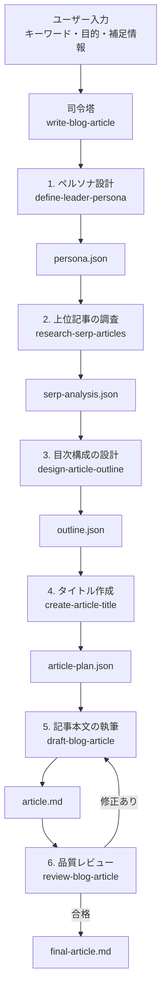

# ブログ記事自動生成スキル群 設計セッション記録

## 1. この資料の目的

AI エージェントを使い、キーワードの入力からブログ記事の完成までを自動化する仕組みについて検討した記録です。

長い一連の指示を 1 つのスキルに詰め込むと、コンテキストが膨らみ、生成品質が下がる懸念があります。そのため、工程別の小さなスキルと、全体を管理する司令塔スキルに分ける方針を採用しました。

## 2. ユーザーから提示された要件

記事制作を次の順番で自動化したい。

1. ペルソナを設定する
2. 指定キーワードについて、ネット上の検索上位 10 記事からタイトルや目次構成を取得する
3. 調査結果を参考に、記事の目次構成を作る
4. 目次の内容を適切に予告するタイトルを考える
5. リード文、本文、まとめを出力する
6. 最終的には、AI エージェントが各工程のスキルを順番に使い、記事を最後まで作る

## 3. 推奨する全体設計

推奨構成は、`1 つの司令塔スキル + 6 つの工程別スキル + 共通の中間成果物` です。



### 工程別スキル

| スキル | 役割 | 主な入力 | 主な出力 |
|---|---|---|---|
| `write-blog-article` | 全工程の司令塔 | ユーザー要件 | 完成記事 |
| `define-leader-persona` | 読者ペルソナ、検索意図、読後行動を定義 | キーワード、補足情報 | `persona.json` |
| `research-serp-articles` | 検索上位 10 記事を調査 | キーワード | `serp-analysis.json` |
| `design-article-outline` | 調査結果から独自の目次を設計 | ペルソナ、SERP 分析 | `outline.json` |
| `create-article-title` | 本文内容と整合するタイトル案を作る | 目次、ペルソナ | `article-plan.json` |
| `draft-blog-article` | リード文、本文、まとめを書く | 記事計画 | `article.md` |
| `review-blog-article` | 論理矛盾、重複、誇張、抜け漏れを検査 | 下書き、記事計画 | `review.json`、完成稿 |

## 4. サブエージェントの使い方に関する議論

### 検討した 3 案

| 案 | 構成 | 長所 | 弱点 |
|---|---|---|---|
| A | 司令塔が全工程を処理 | シンプルで速い | 長文になるほどコンテキストが膨らむ |
| B | 全工程で別のサブエージェントを起動 | 各工程の集中力を保ちやすい | 引き継ぎ漏れ、時間、コストが増える |
| C | 司令塔が管理し、必要な工程だけサブエージェントへ委任 | 品質と運用負荷のバランスが良い | 状態管理の設計が必要 |

推奨は **C 案** です。

司令塔は全体の状態を管理します。コンテキストを多く使う調査、構成設計、本文執筆、第三者レビューはサブエージェントへ委任します。一方、軽いデータ整形や進行管理は司令塔自身が行います。

### 推奨する役割分担

| 工程 | 担当 | 理由 |
|---|---|---|
| 入力整理 | 司令塔 | 軽量であり、全体判断に必要 |
| ペルソナ設計 | サブエージェント | 独立した視点で検索意図を整理できる |
| SERP 調査 | サブエージェント | Web 調査でコンテキストを多く使う |
| 目次設計 | サブエージェント | 調査結果を圧縮し、構造化する重要工程 |
| タイトル作成 | 司令塔またはサブエージェント | 比較的軽量 |
| 本文執筆 | サブエージェント | 最も多くのトークンを使う |
| 品質レビュー | 執筆者とは別のサブエージェント | 第三者視点で見落としを減らせる |
| 最終統合 | 司令塔 | 全体整合性を確認し、完成稿を返す |

### 過度な分割を避ける理由

本文を見出し単位で異なるサブエージェントへ分けすぎると、次の問題が起きやすくなります。

- 文体が揺れる
- 同じ説明を繰り返す
- 前後の章で論理がつながらない

初期版では、本文全体を 1 つの執筆エージェントに任せる方が安定します。

一方、SERP 調査と本文執筆は分ける価値があります。競合記事の情報を本文執筆エージェントへ過剰に渡すと、コンテキストが膨らみ、既存記事の模倣に寄りやすくなるためです。

## 5. 状態管理

サブエージェント間では、会話履歴の全文ではなく、必要な情報だけを構造化ファイルで引き継ぎます。

```text
blog-project/
├── request.json
├── persona.json
├── serp-analysis.json
├── outline.json
├── article-plan.json
├── article.md
├── review.json
└── final-article.md
```

重要なルールは次のとおりです。

- 会話履歴を丸ごと次工程へ渡さない
- SERP 調査結果は URL、見出し構造、共通論点、不足論点に圧縮する
- 競合記事の全文を本文執筆エージェントへ渡さない
- 事実確認が必要な記述には出典 URL を紐づける
- 調査は客観情報を扱う Phase 0 と、ユーザー独自の商品や経験を反映する Phase 1 に分ける

## 6. 試作したスキル

最初の工程として、読者ペルソナを定義するスキルを試作しました。

### スキル名

`define-leader-persona`

ユーザーが提示した名称 `defineLeaderPersona` を、スキル命名規則に合わせて小文字のハイフン区切りへ変換しています。

### 格納場所

```text
C:\Users\Hikaru\.codex\skills\define-leader-persona\
├── SKILL.md
└── agents\
    └── openai.yaml
```

### 責務

このスキルは、読者ペルソナの定義だけを行います。

次の工程には進みません。

- Web 検索
- SERP 調査
- 目次設計
- タイトル作成
- 本文執筆

これにより、スキルの責務が明確になり、後続工程で再利用しやすくなります。

### 入力

- `keyword`: 必須。検索キーワード
- `article_goal`: 任意。読者に到達してほしい状態や事業目的
- `reader_hint`: 任意。想定読者の補足
- `offer`: 任意。紹介する商品、サービス、CTA
- `constraints`: 任意。文体、除外事項、公開条件

### 出力

後続スキルが再利用できるように、短い要約と JSON を返します。

```json
{
  "keyword": "",
  "article_goal": "",
  "primary_persona": {
    "label": "",
    "situation": "",
    "immediate_problem": "",
    "underlying_motivation": "",
    "knowledge_level": "beginner | intermediate | advanced",
    "decision_stage": "exploring | comparing | ready_to_act",
    "desired_outcome": "",
    "likely_questions": [],
    "objections_or_anxieties": []
  },
  "content_direction": {
    "must_cover": [],
    "avoid_or_deprioritize": [],
    "recommended_tone": "",
    "desired_next_action": ""
  },
  "assumptions": [],
  "open_questions": []
}
```

## 7. サブエージェントによる実行テスト

作成した `define-leader-persona` を独立したサブエージェントに使わせ、前方テストを行いました。

スキルの意図した回答内容は教えず、次の条件だけを渡しています。

```text
キーワード「AI ブログ記事 自動作成」で、
AIを使った記事制作の導入方法を初心者向けに説明する
ブログ記事を準備しています。
後続工程で使える読者ペルソナを定義してください。
紹介する商品はまだ決まっていません。
```

### 実際に生成されたペルソナ

```json
{
  "keyword": "AI ブログ記事 自動作成",
  "article_goal": "初心者がAIを使った記事制作の全体像と導入手順を理解し、最初の1記事を試作できる状態になる",
  "primary_persona": {
    "label": "ブログ運営を効率化したいAI初心者",
    "situation": "ブログを始めたい、または更新頻度を上げたいが、記事作成に時間がかかる。AIで効率化できると知り、具体的な始め方を調べている",
    "immediate_problem": "AIに何を任せられるのか、どの順番で使えば記事を作れるのか分からない",
    "underlying_motivation": "執筆時間を減らし、専門知識がなくても継続的に記事を公開したい",
    "knowledge_level": "beginner",
    "decision_stage": "exploring",
    "desired_outcome": "キーワード選定から公開前チェックまでの基本手順を把握し、AIを使って最初の1記事を試作する",
    "likely_questions": [
      "AIだけでブログ記事を作れるのか",
      "記事制作のどの工程をAIに任せられるのか",
      "初心者は何から始めればよいか",
      "コピペで公開して問題ないか",
      "品質やSEOを保つには何を確認すべきか"
    ],
    "objections_or_anxieties": [
      "不自然で似たような記事になりそう",
      "誤情報を公開しそう",
      "SEOで評価されないのではないか",
      "ツール選びが難しそう",
      "操作やプロンプトが複雑そう"
    ]
  },
  "content_direction": {
    "must_cover": [
      "AIが得意な工程と人が確認すべき工程の区別",
      "初心者向けの導入手順",
      "テーマ決定、構成作成、下書き、推敲、事実確認の流れ",
      "AI出力をそのまま公開しない理由",
      "小さく試すための最初のアクション"
    ],
    "avoid_or_deprioritize": [
      "上級者向けの大量生成システム",
      "高度なSEO分析",
      "特定ツールの細かな機能比較",
      "完全自動で収益化できるという印象"
    ],
    "recommended_tone": "専門用語を控え、手順を具体的に示す安心感のある入門トーン",
    "desired_next_action": "読者が自分のブログテーマで1記事分のキーワードを決め、AIを使った試作を始める"
  },
  "assumptions": [
    "読者はAIチャットツールをほとんど使ったことがない",
    "読者の主目的は完全自動化ではなく、執筆時間の短縮と継続しやすさの向上である",
    "紹介商品が未定のため、現段階では中立的な教育記事として設計する"
  ],
  "open_questions": [
    "最終的に紹介したい商品はAIライティングツール、ブログ開設サービス、教材のどれに近いか",
    "想定するブログは副業ブログ、企業ブログ、個人の情報発信のどれか"
  ]
}
```

### テスト結果

試作スキルは期待どおりに動作しました。

- 読者像を 1 つに絞れている
- 検索した背景や悩みを定義できている
- 記事に含める内容と、優先度を下げる内容を分けられている
- 仮定と追加確認事項を明示できている
- SERP 調査や本文執筆へ逸脱していない
- 後続スキルへ渡しやすい JSON 形式になっている

`quick_validate.py` によるスキル構造の検証にも合格しました。

## 8. 自動化の段階

初期段階から自動公開まで進めず、段階的に実装する方針が適切です。

| 段階 | 内容 | 人の役割 |
|---|---|---|
| Phase 1 | 記事の下書きまで自動生成 | 公開前に全文確認 |
| Phase 2 | レビューと自動修正まで実施 | 最終承認のみ |
| Phase 3 | CMS へ下書き保存 | 管理画面で公開判断 |
| Phase 4 | 条件を満たす記事のみ自動公開 | 定期監査 |

医療、法律、金融、商品比較など、誤情報の影響が大きい分野は、完全自動公開の対象外とする方が安全です。

## 9. 今後の実装順序

1. `research-serp-articles`
2. `design-article-outline`
3. `create-article-title`
4. `draft-blog-article`
5. `review-blog-article`
6. `write-blog-article`
7. 1 キーワードを使った結合テスト
8. 実行ログを確認し、サブエージェントへ委任する工程の粒度を調整する

最初の完成目標は、キーワードを渡すと各サブエージェントが順番に作業し、レビュー済みの Markdown 記事を返す状態です。
